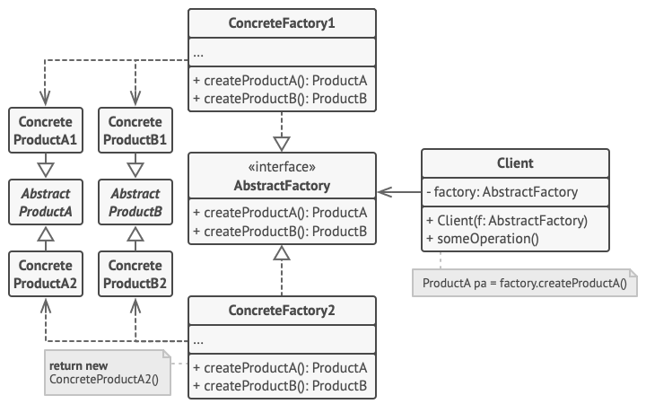

### Concept
Abstract factory pattern tạo ra các họ đối tượng liên quan mà không cần xác định chính xác lớp cụ thể của chúng

Ví dụ: Một Factory được chỉ định là sản xuất giày và áo và các Concrete Factorie (Nike Factory, Adidas Factory,..) họ sẽ implement vào nhà máy đó và sản xuất một nhóm sản phẩm mà nhà máy đó quy định (giày và áo) nhưng theo mẫu mã như thế nào sẽ do Concrete Factorie quyết định.

### Structure
Structure của Abstract factory pattern bao gồm các thành phần:



- Abstract Factory:
    - Là một Abstract Factory định nghĩa một tập hợp các quy tắc để tạo ra các họ đối tượng liên quan.
    - Khai báo một loạt các phương thức, mỗi phương thức chịu trách nhiệm tạo ra một loại Concrete Products.
    - Đảm bảo rằng các Concrete Factories implement vào phải tuân theo một giao diện chung, giúp tạo ra các tập hợp đối tượng liên quan một cách nhất quán.
- Concrete Factorie:
    - Thực hiện các quy tắc được chỉ định bởi Abstract Factory.
    - Chứa logic để tạo ra các thể hiện cụ thể của đối tượng trong một family.
    - Có thể tồn tại nhiều Concrete Factorie, mỗi nhà máy tạo ra một family đối tượng khác nhau.
- Abstract Products:
    - Đại diện cho một famlily của các đối tượng bằng cách định nghĩa một tập hợp các phương thức hoặc thuộc tính chung.
    - Là loại abtract hoặc interface mà tất cả Concrete Products trong một famlily phải tuân theo.
    - Cung cấp cách thống nhất để sử dụng Concrete Products một cách tương đồng.
- Concrete Products:
    - Là các thể hiện thực tế của đối tượng được tạo ra bởi Concrete Factorie.
    - Thực hiện các phương thức được khai báo trong Abstract Products, đảm bảo tính nhất quán trong một famlily của các đối tượng.
- Khách hàng (Client):
    - Sử dụng các giao diện của Abstract Factory và Abstract Product để làm việc với các đối tượng cụ thể.

### Example
```
/*****************************************ABSTRACT FACTORY INTERFACE*****************************************/
type ISportsFactory interface {
	makeShoe() IShoe
	makeShirt() IShirt
}

func GetSportsFactory(brand string) (ISportsFactory, error) {
	if brand == "adidas" {
		return &Adidas{}, nil
	}

	if brand == "nike" {
		return &Nike{}, nil
	}

	return nil, fmt.Errorf("wrong brand type passed")
}

/*****************************************ABSTRACT SHOE*****************************************/
type IShoe interface {
	setLogo(logo string)
	setSize(size int)
	getLogo() string
	getSize() int
}

type Shoe struct {
	logo string
	size int
}

func (s *Shoe) setLogo(logo string) {
	s.logo = logo
}

func (s *Shoe) getLogo() string {
	return s.logo
}

func (s *Shoe) setSize(size int) {
	s.size = size
}

func (s *Shoe) getSize() int {
	return s.size
}

/*****************************************ABSTRACT SHIRT*****************************************/
type IShirt interface {
	setLogo(logo string)
	setSize(size int)
	getLogo() string
	getSize() int
}

type Shirt struct {
	logo string
	size int
}

func (s *Shirt) setLogo(logo string) {
	s.logo = logo
}

func (s *Shirt) getLogo() string {
	return s.logo
}

func (s *Shirt) setSize(size int) {
	s.size = size
}

func (s *Shirt) getSize() int {
	return s.size
}

/*****************************************ADIDAS FACTORY*****************************************/
type Adidas struct {
}

func (a *Adidas) makeShoe() IShoe {
	return &AdidasShoe{
		Shoe: Shoe{
			logo: "adidas",
			size: 14,
		},
	}
}

func (a *Adidas) makeShirt() IShirt {
	return &AdidasShirt{
		Shirt: Shirt{
			logo: "adidas",
			size: 14,
		},
	}
}

type AdidasShoe struct {
	Shoe
}

type AdidasShirt struct {
	Shirt
}

/*****************************************NIKE FACTORY*****************************************/
type Nike struct {
}

func (n *Nike) makeShoe() IShoe {
	return &NikeShoe{
		Shoe: Shoe{
			logo: "nike",
			size: 14,
		},
	}
}

func (n *Nike) makeShirt() IShirt {
	return &NikeShirt{
		Shirt: Shirt{
			logo: "nike",
			size: 14,
		},
	}
}

type NikeShoe struct {
	Shoe
}

type NikeShirt struct {
	Shirt
}

/*****************************************CLIENT CODE*****************************************/
func main() {
	adidasFactory, _ := GetSportsFactory("adidas")
	nikeFactory, _ := GetSportsFactory("nike")

	nikeShoe := nikeFactory.makeShoe()
	nikeShirt := nikeFactory.makeShirt()

	adidasShoe := adidasFactory.makeShoe()
	adidasShirt := adidasFactory.makeShirt()

	printShoeDetails(nikeShoe)
	printShirtDetails(nikeShirt)

	printShoeDetails(adidasShoe)
	printShirtDetails(adidasShirt)
}

func printShoeDetails(s IShoe) {
	fmt.Printf("Logo: %s", s.getLogo())
	fmt.Println()
	fmt.Printf("Size: %d", s.getSize())
	fmt.Println()
}

func printShirtDetails(s IShirt) {
	fmt.Printf("Logo: %s", s.getLogo())
	fmt.Println()
	fmt.Printf("Size: %d", s.getSize())
	fmt.Println()
}
```

### Applicability
Abstract factory pattern thường được áp dụng khi:

- Khi hệ thống cần làm việc với các nhóm đối tượng liên quan hoặc phụ thuộc với nhau

### Pros and Cons
Ưu điểm của Abstract factory:

- Tính nhất quán cao
- Dễ dàng mở rộng
- Quản lý sự phức tạp trong việc tạo đối tượng

Nhược điểm của Abstract factory:

- Phức tạp hơn
- Khó khăn trong việc mở rộng các nhóm sản phẩm
- Tăng số lượng class trong hệ thống
