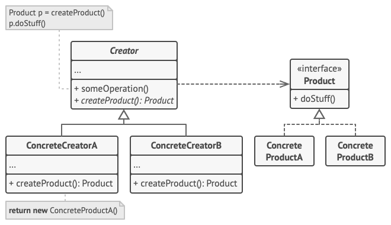

### Concept
Factory menthod cho phép định nghĩa một interface để tạo ra một đối tượng, nhưng để các lớp con quyết định lớp nào sẽ được khởi tạo

Ví dụ: Mình có một nhà máy đưa ra một quy trình chung là sản xuất phương tiện đi lại và có truck, bus và car implement vào và tuân theo quy trình đó mà sản xuất ra các phương tiện cụ thể

### Structure
Structure của Factory-menthod bao gồm các thành phần:



- Abstract Creator (Creator):
    - Là một lớp trừu tượng hoặc interface chứa phương thức factoryMethod().
    - Đây là nơi định nghĩa phương thức tạo đối tượng (Factory Method).
    - Các lớp con sẽ triển khai phương thức này để tạo ra các đối tượng cụ thể.
- Concrete Creators:
    - Là các lớp con của Abstract Creator.
    - Triển khai phương thức factoryMethod() để trả về các đối tượng cụ thể (Concrete Products).
- Abstract Product (Product):
    - Là một lớp trừu tượng hoặc giao diện (interface) chứa các phương thức chung cho các đối tượng cụ thể.
    - Đây là nơi định nghĩa các hành vi chung mà các Concrete Products sẽ triển khai.
- Concrete Products:
    - Là các lớp con của Abstract Product.
    - Triển khai các phương thức cụ thể cho từng loại đối tượng.
- Client:
    - Là nơi sử dụng Factory Method để tạo ra các đối tượng.
    - Client không cần biết trực tiếp về lớp con nào sẽ được tạo ra.

### Example
```
// Factory
type ITransport interface {
	GetName() string
	SetName(name string)
	SetDestination(from string, to string)
	GetInfo() string
}

// Truck factory
type TruckTransport struct {
	name string
	from string
	to   string
}

func (tt *TruckTransport) GetName() string {
	return tt.name
}

func (tt *TruckTransport) SetName(name string) {
	tt.name = name
}

func (tt *TruckTransport) SetDestination(from string, to string) {
	tt.from = from
	tt.to = to
}

func (tt *TruckTransport) GetInfo() string {
	return fmt.Sprintf("%s is delivering a package from %s to %s", tt.name, tt.from, tt.to)
}

func NewTruck() ITransport {
	return &TruckTransport{}
}

// Ship factory
type ShipFactory struct {
	name string
	from string
	to   string
}

func (t *ShipFactory) GetName() string {
	return t.name
}

func (t *ShipFactory) SetName(name string) {
	t.name = name
}

func (t *ShipFactory) SetDestination(from string, to string) {
	t.from = from
	t.to = to
}

func (t *ShipFactory) GetInfo() string {
	return fmt.Sprintf("%s is delivering a container from %s to %s", t.name, t.from, t.to)
}

func NewShip() ITransport {
	return &ShipFactory{}
}

func getTransport(transportType string) (ITransport, error) {
	if transportType == "truck" {
		return NewTruck(), nil
	}
	if transportType == "ship" {
		return NewShip(), nil
	}
	return nil, fmt.Errorf("wrong trainsport type")
}

func main() {
	truck, _ := getTransport("truck")
	ship, _ := getTransport("ship")

	truck.SetName("Monster Truck")
	truck.SetDestination("Ho Chi Minh", "An Giang")

	ship.SetName("Battle Ship")
	ship.SetDestination("USA", "Australia")

	fmt.Println(truck.GetInfo())
	fmt.Println(ship.GetInfo())
}
```

### Applicability
Factory-menthod thường được áp dụng khi:

- Được sử dụng khi muốn tạo ra một đối tượng nhưng không biết trước chính xác kiểu và các phụ thuộc của đối tượng đó. 

### Pros and Cons
Ưu điểm của Factory-menthod:

- Tránh việc tight coupling giữa bên phía cha và con
- Tuân theo nguyên tắc Single Reponsibility Principle và Open/Close Principle

Nhược điểm của Factory-menthod:

-  Mã nguồn có thể trở nên phức tạp hơn mức bình thường.