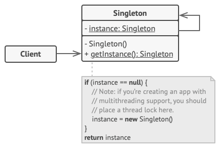

### Concept
Singleton pattern là một mô hình thiết kế phần mềm được sử dụng để đảm bảo rằng một class chỉ có một instance duy nhất, và cung cấp một điểm truy cập toàn cục đến instance đó.

Ví dụ: Muốn khởi tạo kết nối cơ sở dữ liệu để tránh việc tạo nhiều kết nối đồng thời, có thể gây lãng phí tài nguyên và giảm hiệu suất.

### Structure
Structure của Singleton pattern bao gồm các thành phần:



- Singleton Class:
    - Private Static Variable: Một biến static được khai báo ở mức độ private để giữ instance duy nhất của lớp Singleton.
    - Private Constructor: Một constructor được khai báo ở mức độ private để ngăn chặn việc khởi tạo lớp từ bên ngoài thông qua từ khóa new.
    - Public Static Method: Một phương thức static công khai, thường được gọi là getInstance(), được sử dụng để truy cập vào instance duy nhất của lớp. Nếu biến static chứa instance là null, phương thức này sẽ khởi tạo một instance mới và gán cho biến đó. Nếu không, nó sẽ trả về instance hiện tại.
- Client Class:
    - Access Singleton Instance: Lớp này sẽ truy cập vào Singleton instance thông qua phương thức getInstance()

### Example
```
var lock = &sync.Mutex{}

type single struct {
}

var singleInstance *single

func getInstance() *single {
	if singleInstance == nil {
		lock.Lock()
		defer lock.Unlock()
		if singleInstance == nil {
			fmt.Println("Creating single instance now.")
			singleInstance = &single{}
		} else {
			fmt.Println("Single instance already created.")
		}
	} else {
		fmt.Println("Single instance already created.")
	}

	return singleInstance
}

func main() {

	for i := 0; i < 10; i++ {
		go getInstance()
	}

	fmt.Scanln()
}

```

### Applicability
Singleton pattern thường được áp dụng khi:

- Khi cần đảm bảo chỉ có một instance duy nhất của một lớp, ví dụ như một kết nối cơ sở dữ liệu hoặc cấu hình hệ thống.

### Pros and Cons
Ưu điểm của Singleton:

- Singleton giúp đảm bảo rằng chỉ một instance duy nhất của lớp được tạo ra.
- Instance duy nhất của Singleton có thể được truy cập từ bất kỳ nơi nào trong ứng dụng thông qua một phương thức static
- Giảm sự phụ thuộc lẫn nhau giữa các đối tượng, làm cho mã nguồn dễ bảo trì và mở rộng hơn.
- Singleton cho phép việc khởi tạo instance được hoãn lại cho đến khi nó thực sự cần thiết, giúp giảm thiểu chi phí khởi tạo khi ứng dụng khởi chạy (Lazy Initialization).

Nhược điểm của Singleton:

- Vi phạm Single Responsibility Principle.
- Singleton có thể làm cho các thành phần trong chương trình quá phụ thuộc lẫn nhau và khó để bảo trì hoặc mở rộng sau này.
- Trong môi trường đa luồng, việc đảm bảo rằng chỉ có một instance duy nhất được tạo ra và không có xung đột hay race conditions yêu cầu thiết kế cẩn thận và có thể cần sử dụng các kỹ thuật đồng bộ hóa.
